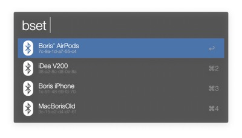
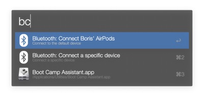
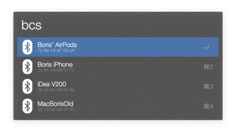
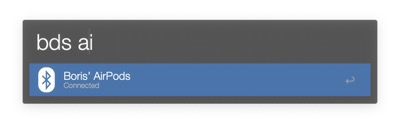
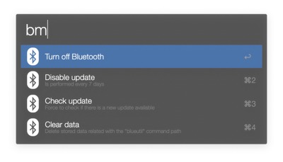
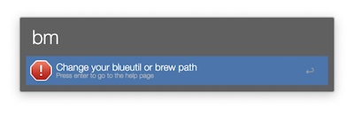
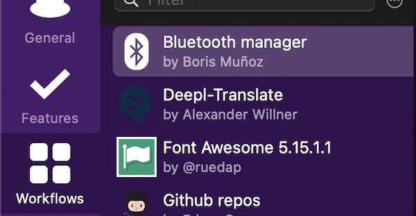
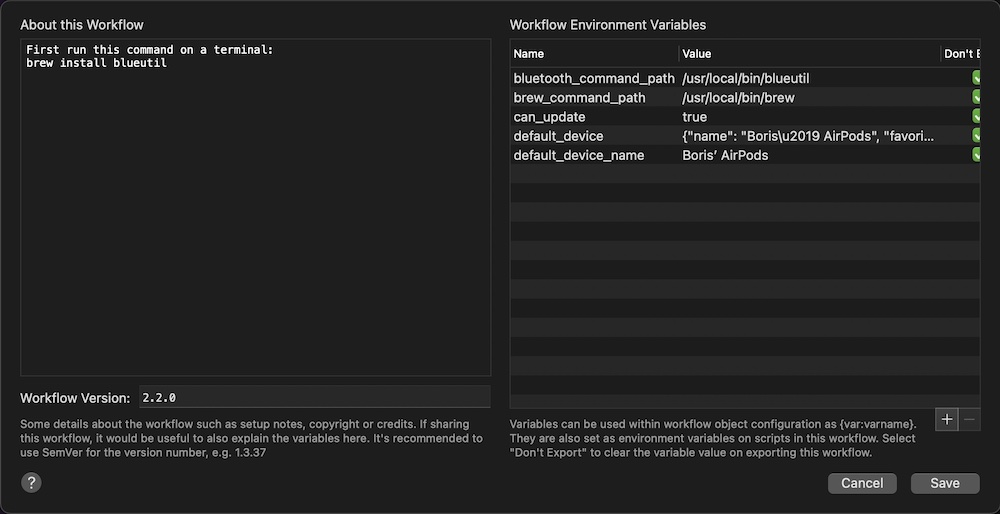

# 🚨 Supports Alfred 4 🚨

> Workflows created or edited in any version of Alfred are fundamentally incompatible with earlier versions, even if no new features are used.

https://www.deanishe.net/alfred-workflow/guide/update.html#id3

I am using alfred 4, therefore I cannot make it compatible with alfred 3

# 💻 Installation 👾

Install brew https://brew.sh/

And then run this command on a terminal:
```bash
brew install blueutil
```

Now [download][last release link] ⏬ the last release and open it 😎. That's all!!

# 📸 Screenshots







# 🔑 Keywords

- `bset`: Set the default device
- `bc`: Connect the default device
- `bd`: Disconnect the default device
- `bcs`: Select the device you would like to connect to
- `bds`: Select the device you would like to disconnect to
- `bm`:
    - Bluetooth on and off
    - Enable and disabled check of updates
    - Manually check for an update
    - Clear data: Allowing to clear the blueutil path saved(just in case 🤷🏽‍♂️)

# 🆘 Help

## - What should I do if a get the message "Change your blueutil or brew path"?



To get them, run the following commands in your own terminal:
```bash
> which brew # paste this command
/usr/local/bin/brew # this is just an example result
> which blueutil # and paste this one
/usr/local/bin/blueutil # this is just an example result
```

Copy both results and follow the steps in the next point.

---

## - How to set my own `brew`/`blueutil` path?

### Step 1: Open your Alfred settings inside the workflows panel



### Step 2: Press the button "Configure workflow and variables"


### Step 3: Edit `bluetooth_command_path` or `brew_command_path` variables with your own




Easy peasy! 😋

[last release link]: https://github.com/bmunoz89/alfred-wf-bluetooth-manager/releases/latest/download/Bluetooth.manager.alfredworkflow