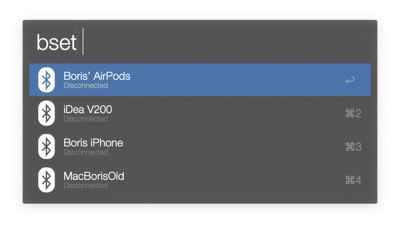
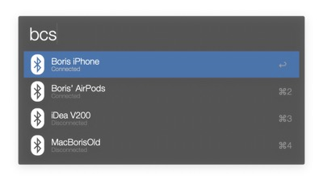

#### 🚨 Supports Alfred 3 & 4 🚨

# 💻 Installation 👾

Run this command on a terminal:
```bash
brew install blueutil
```

Now [download][last release link] ⏬ the last release and open it 😎. That's all!!

# 📸 Screenshots






# 🔑 Keywords

- `bset`: Set the default device
- `bc`: Connect the default device
- `bd`: Disconnect the default device
- `bcs`: Select the device you would like to connect to
- `bds`: Select the device you would like to disconnect to
- `bm`:
    - Bluetooth on and off
    - Enable and disabled check of updates
    - Manually check for an update
    - Clear data: Allowing to clear the blueutil path saved(just in case 🤷🏽‍♂️)

Besides that, you can add shortcuts into the preferences 👌🏽

[last release link]: https://github.com/bmunoz89/alfred-wf-bluetooth-manager/releases/latest/download/Bluetooth.manager.alfredworkflow